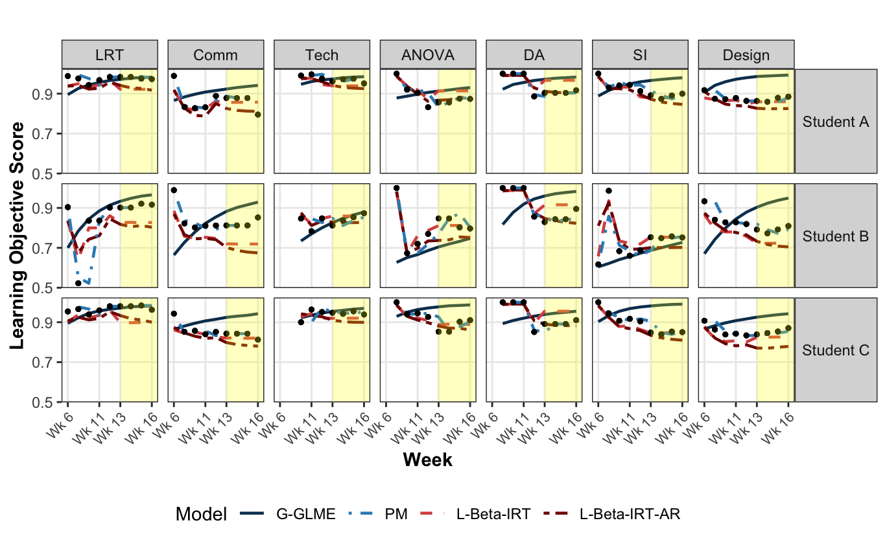

# Facilitating Student-Instructor Conversation with Bayesian Item Response Theory

Knowing the learning progressions of students allows instructors to cultivate responsive learning environments. This is especially important in a classroom that uses alternative grading systems, which makes it difficult for instructors to know and track the learning outcomes of students. We introduce a longitudinal Beta Item Response Theory (IRT) model with a Bayesian framework for predicting continuous responses that measure different components of a student's learning progression in a standards-based grading (SBG) classroom. By comparing the prediction accuracy of our model with traditional longitudinal IRT models for binary responses, we show that modeling students' responses on a continuous scale provides a more granular understanding of student growth and better prediction of learning outcomes. Moreover, our modeling framework produces information about students' proficiency that is both interpretable and reliable. Such information can assist instructors in tailoring their teaching practice to support the success of every student.

{fig-alt="L_IRT"}

Links: [ICOTS12 proceedings paper](files/ICOTS12_Cervantes.pdf), [ICOTS12 slides](files/ICOTS12_slides.pdf)
